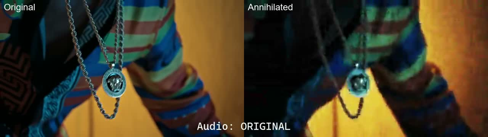
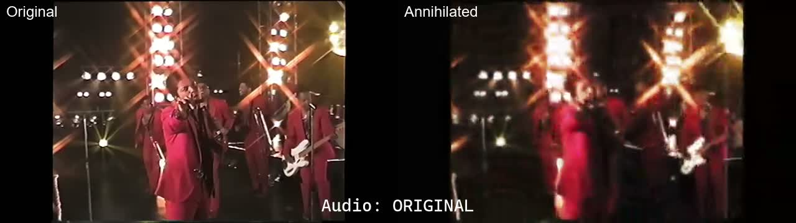
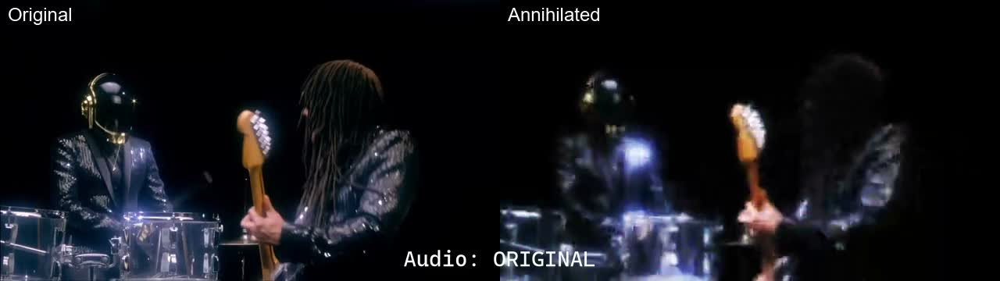
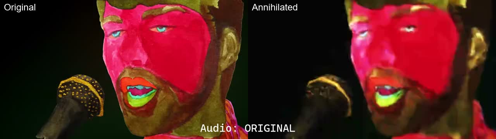
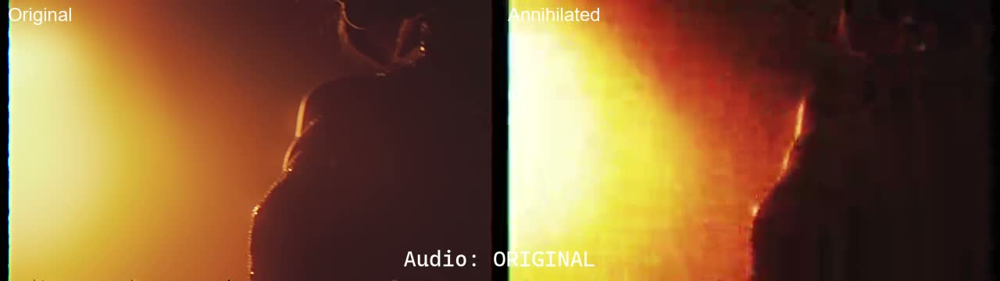
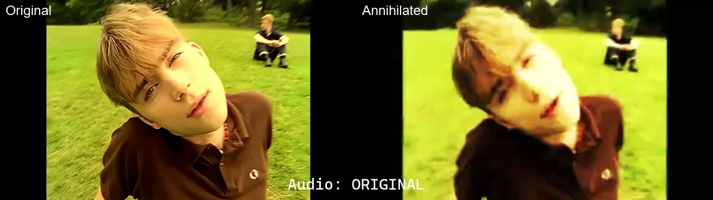

# FFMPEG Media Annihilator - Demos

## 🎬 Video Demos

Side-by-side comparisons of original vs processed (ANNIHILATED) videos:

### Bruno Mars - 24k Magic

### Bruno Mars - Treasure  

### Daft Punk - Get Lucky

### Breakbot - Baby I'm Yours

### The Weeknd - I Feel It Coming

### Blur - Chemical World

---

## ℹ️ Important Notes

### Legal & Fair Use
- **Educational Purpose**: All demos are for education and demonstration only
- **No Rights Claimed**: We do not own rights to original content
- **Transformative Use**: Content is significantly altered from original
- **Short Clips**: Demos use brief excerpts, not full works
- **Non-Commercial**: No monetization of demo content

### Technical Details
- **Side-by-Side**: Shows original vs processed comparison
- **Default Settings**: All demos use application default parameters
- **Click Thumbnails**: Links to full demo video files
- **GitHub Limitation**: Platform doesn't embed video players directly

### Demo Creation
- **Script**: Demos created using `compare_videos_ffmpeg.ps1`
- **Customizable**: You can create your own comparisons
- **Not Maintained**: Script provided as-is, may need updates

### Usage Guidelines
- **Reference Only**: Use as examples of software capabilities
- **Respect Copyright**: Do not redistribute original content
- **Attribute**: Credit original creators when appropriate
- **Educational Context**: Best for learning about media processing

---

**⚠️ Disclaimer**: These demonstrations are provided for educational purposes to showcase the software's capabilities. Original content rights belong to their respective owners.
