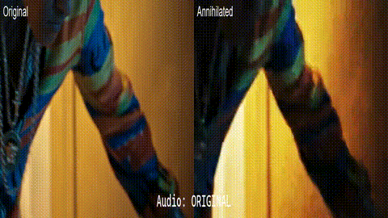
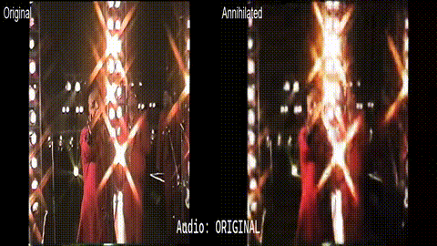
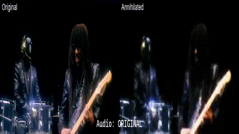
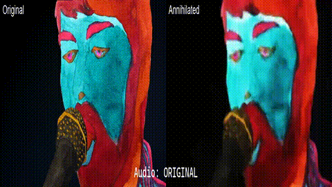
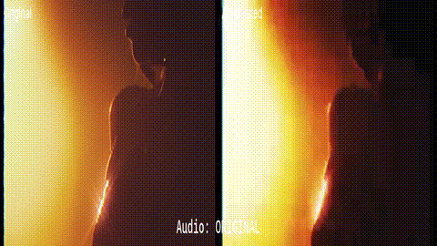

# FFMPEG Media Annihilator

A powerful GUI application to manipulate and annihilate video files with media effects using FFMPEG.


## Demos
Side-by-side comparison of original vs processed (ANNIHILATED) videos:

### Demo Videos

Side-by-side comparisons of original vs annihilated videos (animated GIFs play automatically, click for full video):

#### Bruno Mars - 24k Magic
[](demos/24k.mp4)

#### Bruno Mars - Treasure  
[](demos/bruno.mp4)

#### Daft Punk - Get Lucky
[](demos/getlucky.mp4)

#### Breakbot - Baby I'm Yours
[](demos/babyimyours.mp4)

#### The Weeknd - I Feel It Coming
[](demos/ifeelitcoming.mp4)

**Note**: Animated GIFs play automatically in GitHub. Click any GIF to download the full HD video file.

### Notes
- The music video of the respective songs are used for the demos. I do not own the rights to these videos and they are used for demonstration purposes only. I made sure that the demos are not too long and won't upset anyone.
- The demos are side-by-side comparisons of original vs processed videos. The processed videos are the "ANNIHILATED" versions.
- The videos are processed using the default settings of the application. Which you can tune however you want.
- The side-by-side videos are created using the `compare_videos_ffmpeg.ps1` script which you can use to create your own comparisons. I probably won't be maintaining that script, so if it breaks, you're on your own.

## Features

### Video Effects
- **Resolution Scaling**: Reduce video resolution to 10%-100% of original
- **Blur**: Apply Gaussian blur (0-10 sigma)
- **Compression**: Adjust CRF (18-51) for compression artifacts
- **Media Artifacts**: Add noise, color shifts, and scanlines for authentic media degradation

### Audio Effects
- **Volume Control**: 0% to 500% boost (earrape capable!)
- **Compression**: Reduce audio bitrate (16k-64k)
- **High Pass Filter**: Remove low frequencies (0-1000Hz)
- **Low Pass Filter**: Remove high frequencies (1000-8000Hz)
- **Reverb**: Add echo/delay effects
- **Distortion**: Bit-crushing for gritty texture
- **Sample Rate**: Quality reduction (8kHz-48kHz)

### GUI Features
- Modern PyQt6 interface with dark theme
- File selection for input/output
- Real-time parameter adjustment
- Live preview with debounced updates
- Progress tracking during processing
- Dynamic earrape warnings (200%+ volume)
- Automatic fallback for complex audio effects
- FFMPEG command preview
- Cross-platform compatibility


## Requirements

- Python 3.6+
- PyQt6
- FFMPEG (must be in system PATH)

## Installation

1. Ensure FFMPEG is installed and in your system PATH
2. Clone or download this repository
3. Run the GUI application:

```bash
python ffmpeg_annihilator.py
```

## Usage

1. Click "Select Input Video" to choose your source video
2. Adjust video and audio parameters using the sliders and controls
3. Click "Preview Settings" to see the FFMPEG command that will be executed
4. Click "Process Video" to apply the effects
5. Wait for processing to complete

## Video Effects Explained

- **Resolution Scaling**: Uses nearest-neighbor scaling for pixelated look
- **Blur**: Gaussian blur for that out-of-focus VHS feel
- **Compression**: Higher CRF values create more compression artifacts
- **VHS Artifacts**: Combines multiple filters for authentic VHS degradation

## Audio Effects Explained

- **Bitrate Reduction**: Creates compressed, low-quality audio
- **High Pass Filter**: Removes bass frequencies for tinny sound
- **Low Pass Filter**: Removes treble frequencies for muffled sound

## Supported Formats

- Input: MP4, AVI, MOV, MKV, WebM, FLV
- Output: MP4, AVI, MOV (default: MP4)

## Tips

- Start with lower resolution (25%) and high compression (35+) for strong VHS effect
- Combine audio filters (300Hz high pass + 3000Hz low pass) for phone-like quality
- Enable VHS artifacts for authentic vintage look
- Use "Preview Settings" to understand the FFMPEG command being generated

## Troubleshooting

- **FFMPEG not found**: Ensure FFMPEG is installed and in your system PATH
- **Processing fails**: Check that input file exists and output location is writable
- **No audio effects**: Make sure "Enable Audio Processing" is checked

## License

This project is open source. Feel free to modify and distribute.
